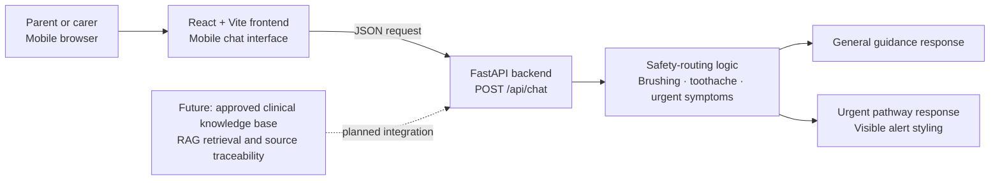

# Children's Oral Health Support

A mobile-friendly, parent-facing oral-health chatbot prototype developed for a UK university project.

## Project purpose

This project explores how a safety-first chat interface could help parents access clear, general information about children’s oral health.

The current version is an early demonstration prototype. It has been designed to show the planned user interaction, basic safety routing, and communication between a mobile web interface and a Python backend while the approved clinical knowledge base is pending.

## Current prototype scope

The prototype currently supports three parent pathways:

1. **Everyday prevention**
   General guidance about toothbrushing routines and oral-health prevention.

2. **Child toothache**
   General next-step information encouraging parents to seek dental assessment when appropriate.

3. **Urgent symptoms**
   Safety-focused routing for symptoms such as facial swelling, breathing difficulty, uncontrolled bleeding, or dental injury.

The current response logic is deliberately limited and rule-based. It does not diagnose dental conditions.

## System architecture



## Current features

* Mobile-friendly parent-facing chat interface.
* Three fixed demonstration scenarios.
* Free-text question input.
* React frontend connected to a FastAPI backend.
* `POST /api/chat` endpoint for chat requests.
* Distinct general, toothache, and urgent response pathways.
* Red urgent-response styling for safety-related messages.
* Local FastAPI documentation at `/docs`.
* Git and GitHub version history.

## Technology stack

* **Frontend:** React, TypeScript, Vite
* **Backend:** Python, FastAPI, Uvicorn
* **Current response method:** Rule-based safety routing
* **Version control:** Git and GitHub
* **Target platform:** Mobile-friendly web application

## Repository structure

```text
oral-health-chatbot/
├── backend/
│   ├── main.py
│   └── requirements.txt
├── frontend/
│   ├── src/
│   │   ├── App.tsx
│   │   └── App.css
│   ├── package.json
│   └── vite.config.ts
├── .gitignore
└── README.md
```

## Running the prototype locally

### 1. Activate the project environment

```cmd
cd /d X:\oral-health-chatbot
conda activate oral-health-chatbot
```

### 2. Start the frontend

Open one terminal:

```cmd
cd /d X:\oral-health-chatbot
conda activate oral-health-chatbot
cd frontend
npm run dev
```

Then open the local address shown in the terminal, usually:

```text
http://localhost:5173/
```

### 3. Start the backend

Open a second terminal:

```cmd
cd /d X:\oral-health-chatbot
conda activate oral-health-chatbot
cd backend
python -m uvicorn main:app --reload --port 8000
```

The local API documentation is available at:

```text
http://127.0.0.1:8000/docs
```

## Suggested supervisor demonstration

1. Open the mobile chat interface.
2. Explain that the current build is a safety-first demonstration prototype while the approved knowledge base is pending.
3. Select **Everyday prevention** to show a general prevention pathway.
4. Select **Child toothache** to show a non-emergency dental advice pathway.
5. Select **Urgent symptoms** to show the visually distinct urgent pathway.
6. Enter the following message manually:

```text
My child has facial swelling and difficulty breathing
```

7. Show that the frontend sends the message to the FastAPI backend and displays an urgent response.
8. Open the API documentation page to demonstrate the available endpoint.
9. Show the system architecture diagram and explain the planned future knowledge-base integration.

## Current limitations

* This is a university demonstration prototype, not a clinical product.
* It does not replace professional dental advice.
* It is not an NHS service.
* It does not currently use patient data, user accounts, or data storage.
* It does not currently use an approved clinical dataset.
* It does not yet use retrieval-augmented generation or a large language model.
* The current rule-based responses cover only a small set of demonstration scenarios.

## Planned next steps

* Integrate approved child oral-health knowledge sources.
* Add retrieval-augmented generation with source traceability.
* Expand safety rules and test cases with supervisor and domain-expert feedback.
* Evaluate answer relevance, safety, and retrieval performance.
* Improve accessibility and mobile installation support.
* Conduct structured user testing with parents or relevant stakeholders.

## Version history

* **Initial prototype:** Mobile React chat interface with fixed demonstration questions.
* **API integration:** FastAPI backend connected to the frontend using `POST /api/chat`.
* **Safety-routing refinement:** Separate prevention, toothache, and urgent pathways with visible urgent-response styling.
* **Documentation stage:** README, system architecture diagram, local setup instructions, and demonstration script.
