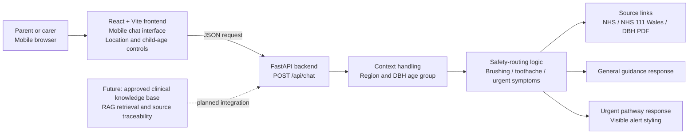

# Children's Oral Health Support

A mobile-friendly, parent-facing oral-health chatbot prototype developed for a UK university project.

## Project purpose

This project explores how a safety-first chat interface could help parents access clear, general information about children's oral health.

The current version is an early demonstration prototype. It shows a parent-facing mobile interface, a FastAPI backend, rule-based safety routing, parent context fields, and source links while the approved clinical knowledge base is still pending.

The prototype does not diagnose dental conditions. It does not replace professional dental advice and is not an NHS service.

## Current prototype scope

The prototype currently supports three parent pathways:

1. **Everyday prevention**
   General guidance about toothbrushing routines and oral-health prevention.

2. **Child toothache**
   General next-step information encouraging parents to seek dental assessment when appropriate.

3. **Urgent symptoms**
   Safety-focused routing for symptoms such as facial swelling, breathing difficulty, uncontrolled bleeding, or dental injury.

The current response logic is deliberately limited and rule-based. It is intended to demonstrate the product flow, safety hierarchy, and future source-traceability structure before RAG or LLM integration.

## System architecture



## Current features

* Mobile-friendly parent-facing chat interface.
* Three fixed demonstration scenarios.
* Free-text question input.
* Location selector: England, Wales, Scotland, Northern Ireland, or Not sure.
* Child-age selector based on Delivering better oral health age groups: 0-3, 3-6, or 7+.
* Age-sensitive questions ask for an age group only when needed.
* Questions that include an age, such as "8-year-old", are mapped to the appropriate age group.
* React frontend connected to a FastAPI backend.
* `POST /api/chat` endpoint for chat requests.
* Distinct general, toothache, and urgent response pathways.
* Red urgent-response styling for safety-related messages.
* Clickable source links shown below supported answers.
* Small-sample response test table for recording answer quality and source gaps.
* Local FastAPI documentation at `/docs`.
* Git and GitHub version history.

## Current source-link behaviour

The prototype attaches source metadata to supported answers. The frontend renders these as clickable links below the assistant response.

Current first-pass sources include:

* NHS - Children's teeth
* NHS - How to find an emergency or urgent NHS dentist appointment
* NHS 111 Wales - Dental Helplines
* Delivering better oral health PDF - local file, pages 9-11

Region-specific dental-service advice is intentionally conservative:

* England dental-service questions can use the NHS urgent/emergency dentist source.
* Wales dental-service questions can use NHS 111 Wales Dental Helplines.
* Scotland, Northern Ireland, and Not sure currently return a source-gap message for dental-service questions until approved official sources are added.
* General brushing/toothpaste guidance can still use NHS children's teeth and the DBH PDF even when the location is Not sure.

## Technology stack

* **Frontend:** React, TypeScript, Vite
* **Backend:** Python, FastAPI, Uvicorn
* **Current response method:** Rule-based safety routing with manually registered source links
* **Testing:** pytest with FastAPI TestClient
* **Version control:** Git and GitHub
* **Target platform:** Mobile-friendly web application

## Repository structure

```text
oral-health-chatbot/
|-- backend/
|   |-- main.py
|   |-- requirements.txt
|   |-- requirements-dev.txt
|   `-- tests/
|       `-- test_api.py
|-- docs/
|   `-- small_sample_response_test_2026-07-03.md
|-- frontend/
|   |-- src/
|   |   |-- App.tsx
|   |   `-- App.css
|   |-- package.json
|   `-- vite.config.ts
|-- .gitignore
`-- README.md
```

## Running the prototype locally

### 1. Activate the project environment

```cmd
cd /d X:\oral-health-chatbot
conda activate oral-health-chatbot
```

### 2. Start the backend

Open one terminal:

```cmd
cd /d X:\oral-health-chatbot
conda activate oral-health-chatbot
cd backend
python -m uvicorn main:app --reload --port 8000
```

The local API documentation is available at:

```text
http://127.0.0.1:8000/docs
```

### 3. Start the frontend

Open a second terminal:

```cmd
cd /d X:\oral-health-chatbot
conda activate oral-health-chatbot
cd frontend
npm run dev
```

Then open the local address shown in the terminal, usually:

```text
http://localhost:5173/
```

### 4. Running automated tests

The backend includes automated tests for the main parent pathways, age-group handling, source metadata, and safety-routing behaviour.

Open a terminal and run:

```cmd
cd /d X:\oral-health-chatbot
conda activate oral-health-chatbot
cd backend
python -m pytest -q
```

Expected result:

```text
12 passed
```

The current tests verify:

* The backend health-check endpoint is available.
* Age-sensitive brushing questions ask for an age group when the age is missing.
* Toothbrushing questions use the brushing pathway once an age group is selected or inferred.
* A question mentioning an 8-year-old is inferred as the DBH 7+ age group.
* Location set to Not sure still allows general brushing guidance sources.
* Toothache questions use the toothache pathway.
* Wales urgent dental questions return Wales-relevant source metadata.
* Scotland dental-service questions report a source gap instead of inventing a service route.
* Facial swelling with breathing difficulty is treated as an emergency.
* Unrecognised questions use the general-information pathway.
* Empty messages are rejected by the API.

## Suggested supervisor demonstration

1. Open the mobile chat interface.
2. Explain that the current build is a safety-first demonstration prototype while the approved knowledge base is pending.
3. Show the Location and Child age selectors.
4. Select **Everyday prevention** to show the age-aware prevention pathway.
5. Enter the following message manually to show automatic age-group inference and clickable sources:

```text
How should my 8-year-old brush their teeth?
```

6. Select **Child toothache** to show a non-emergency dental advice pathway.
7. Select **Urgent symptoms** to show the visually distinct urgent pathway.
8. Enter the following message manually:

```text
My child has facial swelling and difficulty breathing
```

9. Show that the frontend sends the message to the FastAPI backend and displays an urgent response.
10. Open the API documentation page to demonstrate the available endpoint.
11. Show the system architecture diagram and explain the planned future knowledge-base integration.

## Small-sample testing

A small-sample response test table is available at:

```text
docs/small_sample_response_test_2026-07-03.md
```

Use it to record:

* Parent question
* Location
* Child age or inferred age group
* Expected behaviour
* Actual answer summary
* Evidence links shown
* Whether each link opens correctly
* Source gaps found
* Next official source to add
* Pass / revise decision

## Current limitations

* This is a university demonstration prototype, not a clinical product.
* It does not replace professional dental advice.
* It is not an NHS service.
* It does not currently use patient data, user accounts, or data storage.
* It does not currently use an approved clinical dataset.
* It does not yet use retrieval-augmented generation or a large language model.
* The current rule-based responses cover only a small set of demonstration scenarios.
* Source links are currently manually registered in the backend, not yet managed through a full source registry.
* Scotland and Northern Ireland dental-service sources have not yet been added.

## Planned next steps

* Run the small-sample response test table and record answer quality, link behaviour, and source gaps.
* Move manually registered sources into a maintainable `source_registry.json`.
* Add more precise England, Wales, Scotland, and Northern Ireland dental-service sources.
* Integrate approved child oral-health knowledge sources.
* Add retrieval-augmented generation with source traceability.
* Expand safety rules and test cases with supervisor and domain-expert feedback.
* Evaluate answer relevance, safety, source quality, and retrieval performance.
* Improve accessibility and mobile installation support.
* Conduct structured user testing with parents or relevant stakeholders.

## Version history

* **Initial prototype:** Mobile React chat interface with fixed demonstration questions.
* **API integration:** FastAPI backend connected to the frontend using `POST /api/chat`.
* **Safety-routing refinement:** Separate prevention, toothache, and urgent pathways with visible urgent-response styling.
* **Documentation stage:** README, system architecture diagram, local setup instructions, and demonstration script.
* **7.3 context and source-link update:** Added region selection, DBH age-group handling, clickable source links, source-gap handling, and a small-sample response test table.
